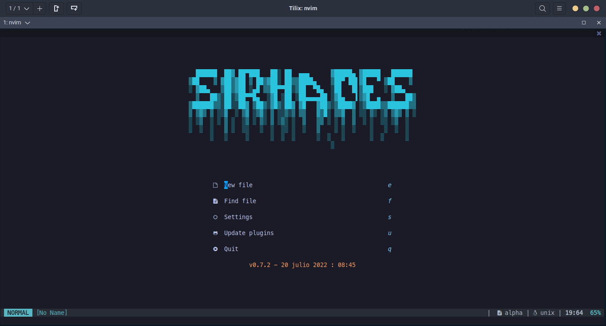
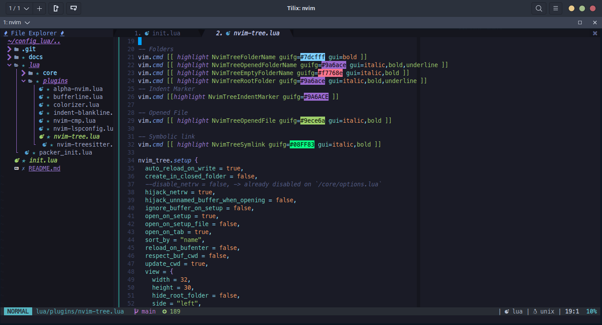

# Configuración de NVIM con Lua

Todas las configuraciones han sido extraídas del repositorio `neovim-lua` de `Brainfucksec`.

Este repositorio se ha usado como plantilla.

[`Plantilla Original | Template`](https://github.com/brainfucksec/neovim-lua)

## Configuración general

- Lenguajes:
  - c
  - python
  - bash
  - typescript
  - json
  - vim
  - lua
  - html
  - css
  - cpp
  - javascript

### Servers LSP:

- Instalación vía npm:

```bash
sudo npm install -g bash-language-server pyright vscode-langservers-extracted typescript typescript-language-server neovim dockerfile-language-server-nodejs vscode-langservers-extracted sql-language-server prettier eslint_d @tailwindcss/language-server
```

- Instalación para marksman

  - [Marksman](https://github.com/artempyanykh/marksman#how-to-install)

### Modificaciones y configuraciones adicionales

- Se ha agregado los siguientes plugins y configuraciones:

  - [`Tokyonight Theme`](https://github.com/folke/tokyonight.nvim)
  - [`Nvim - Colorizer`](https://github.com/norcalli/nvim-colorizer.lua)
  - [`MarkDown Preview`](https://github.com/iamcco/markdown-preview.nvim)
  - [`BufferLine`](https://github.com/akinsho/bufferline.nvim)
  - [`Nvim comment`](https://github.com/terrortylor/nvim-comment)
  - [`Telescope`](https://github.com/nvim-telescope/telescope.nvim)
  - `Provider` - Configuración personal
  - [`Null-ls`](https://github.com/jose-elias-alvarez/null-ls.nvim)
  - [`Trouble`](https://github.com/folke/trouble.nvim)

- Se han modificado los siguientes archivos para una configuración personal:

  - [`core/colors.lua`](core/colors.lua)
  - [`core/keymaps.lua`](core/keymaps.lua)
  - [`core/statusline.lua`](core/statusline.lua)
  - [`plugins/alpha-nvim.lua`](plugins/alpha-nvim.lua)
  - [`plugins/indent-blankline.lua`](plugins/indent-blankline.lua)
  - [`plugins/nvim-tree.lua`](plugins/nvim-tree.lua)

## Screenshots




